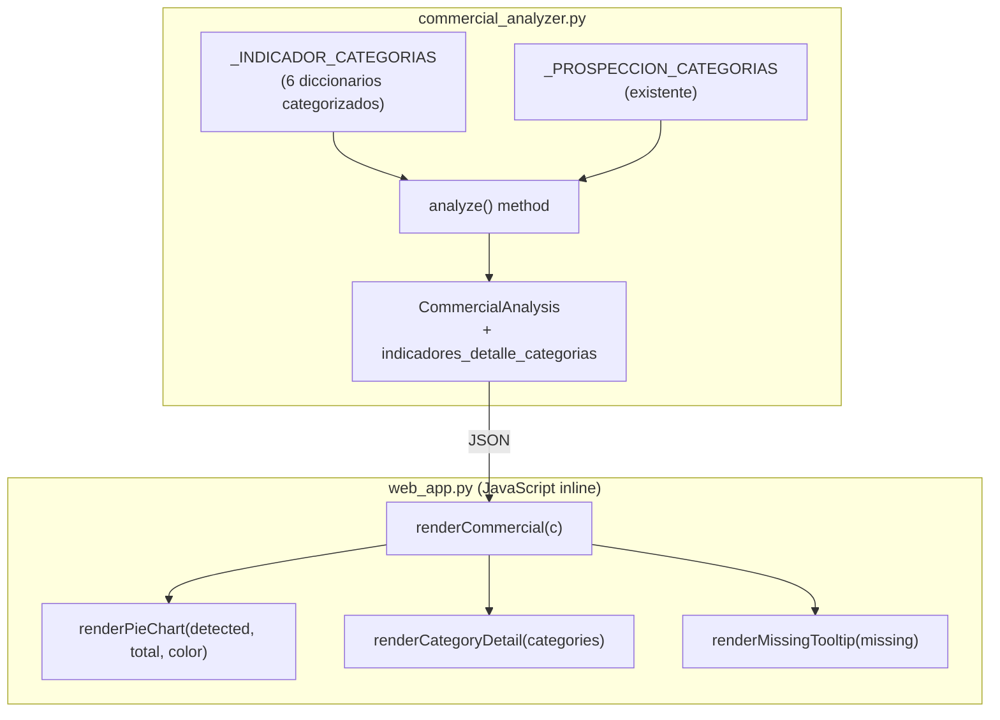

# Documento de Diseño: Detalle de Indicadores Comerciales

## Visión General

Este diseño extiende el sistema de indicadores comerciales para que los 6 indicadores planos (Palabras Positivas, Respuestas Afirmativas, Indicios de Cierre, Escasez Comercial, Pedidos de Referidos, Objeciones) tengan la misma riqueza de detalle que ya tiene Prospección: diccionarios categorizados, panel de detalle por categoría, gráfico de torta CSS y tooltip con frases faltantes.

El cambio afecta tres capas:
1. **Datos** — Nuevos diccionarios `_INDICADOR_CATEGORIAS` en `commercial_analyzer.py`
2. **Lógica** — Extensión del método `analyze()` para producir detalle categorizado por indicador
3. **Presentación** — Modificación de `renderCommercial()` en `web_app.py` para renderizar pie chart, panel categorizado y tooltip

## Arquitectura



## Componentes e Interfaces

### 1. Diccionarios de Categorías (Backend)

Se define un nuevo diccionario por cada indicador plano. La estructura sigue el mismo patrón que `_PROSPECCION_CATEGORIAS`:

```python
_INDICADOR_CATEGORIAS: dict[str, dict[str, list[str]]] = {
    "palabras_positivas": {
        "entusiasmo": ["excelente", "genial", "fantastico", ...],       # ≥10 frases
        "aprobacion": ["bueno", "buena", "perfecto", ...],              # ≥10 frases
        "satisfaccion": ["great", "wonderful", "amazing", ...],         # ≥10 frases
    },
    "respuestas_afirmativas": {
        "confirmacion_directa": ["si", "claro", "ok", "dale", ...],
        "acuerdo": ["correcto", "exacto", "afirmativo", ...],
        "disposicion": ["por supuesto", "con gusto", "absolutely", ...],
    },
    "indicios_cierre": {
        "accion_inmediata": ["reservar", "firmar", "cerrar", ...],
        "compromiso": ["confirmar", "confirmamos", "acordamos", ...],
        "avance": ["avanzar", "proceder", "proceed", ...],
    },
    "escasez_comercial": {
        "disponibilidad": ["disponible", "disponibles", "available", ...],
        "urgencia_temporal": ["ultimos", "ultima", "ultimo", ...],
        "limitacion": ["limitado", "limitada", "pocas", "pocos", ...],
    },
    "pedidos_referidos": {
        "solicitud_directa": ["conoces", "conoce", "alguien", ...],
        "recomendacion": ["recomendar", "recomiendas", "recommend", ...],
        "red_contactos": ["referido", "referidos", "contacto", ...],
    },
    "objeciones": {
        "precio": ["precio", "caro", "cara", "costoso", "expensive", ...],
        "indecision": ["duda", "dudas", "pensar", "pensarlo", ...],
        "postergacion": ["esperar", "despues", "wait", "later", ...],
    },
}
```

**Reglas de diseño:**
- Cada indicador tiene ≥3 subcategorías
- Cada subcategoría tiene ≥10 frases
- Todas las palabras del `_KEYWORDS` original están incluidas en alguna subcategoría
- Las frases pueden ser multi-palabra (igual que `_PROSPECCION_CATEGORIAS`)

### 2. Extensión del Dataclass `CommercialAnalysis`

Se agrega un nuevo campo para almacenar el detalle categorizado de todos los indicadores:

```python
@dataclass
class CommercialAnalysis:
    # ... campos existentes ...
    
    # Nuevo: detalle por categoría para cada indicador
    # Estructura: {indicador: {categoria: [frases_detectadas]}}
    indicadores_detalle_categorias: dict = field(default_factory=dict)
    
    # Nuevo: totales por indicador (para calcular porcentaje del pie chart)
    # Estructura: {indicador: total_frases_en_diccionario}
    indicadores_total_frases: dict = field(default_factory=dict)
```

### 3. Modificación del método `analyze()`

Se agrega un nuevo método privado `_analyze_indicador_categorias()` similar a `_analyze_prospeccion()`:

```python
def _analyze_indicador_categorias(self, normalized: str) -> tuple[dict, dict]:
    """
    Analiza frases por categoría para cada indicador.
    
    Returns:
        tuple: (detalle_categorias, totales)
            - detalle_categorias: {indicador: {categoria: [frases_detectadas]}}
            - totales: {indicador: total_frases_en_diccionario}
    """
    detalle: dict[str, dict[str, list[str]]] = {}
    totales: dict[str, int] = {}
    
    for indicador, categorias in _INDICADOR_CATEGORIAS.items():
        indicador_detalle: dict[str, list[str]] = {}
        total_frases = 0
        for categoria, frases in categorias.items():
            total_frases += len(frases)
            encontradas = []
            for frase in frases:
                if _count_keyword(normalized, frase) > 0:
                    encontradas.append(frase)
            if encontradas:
                indicador_detalle[categoria] = encontradas
        if indicador_detalle:
            detalle[indicador] = indicador_detalle
        totales[indicador] = total_frases
    
    # Incluir prospección (ya existente)
    totales["indicios_prospeccion"] = sum(
        len(frases) for frases in _PROSPECCION_CATEGORIAS.values()
    )
    
    return detalle, totales
```

En `analyze()`, se invoca después de `_analyze_prospeccion()`:

```python
# En analyze():
ca.prospeccion_detalle = self._analyze_prospeccion(normalized)
indicadores_cat, indicadores_tot = self._analyze_indicador_categorias(normalized)
# Unificar prospección en la misma estructura
indicadores_cat["indicios_prospeccion"] = ca.prospeccion_detalle
ca.indicadores_detalle_categorias = indicadores_cat
ca.indicadores_total_frases = indicadores_tot
```

### 4. Frontend — Gráfico de Torta CSS

Función JavaScript para renderizar el pie chart con `conic-gradient`:

```javascript
function renderPieChart(detected, total, color) {
    if (total === 0) return '';
    const pct = Math.round((detected / total) * 100);
    const deg = Math.round((pct / 100) * 360);
    return `
    <div style="position:relative; width:48px; height:48px; border-radius:50%;
                background: conic-gradient(${color} 0deg ${deg}deg, #2a2a2a ${deg}deg 360deg);
                display:flex; align-items:center; justify-content:center;">
        <div style="width:30px; height:30px; border-radius:50%; background:#0f1117;
                    display:flex; align-items:center; justify-content:center;">
            <span style="font-size:0.6rem; color:#fff; font-weight:600;">${pct}%</span>
        </div>
    </div>`;
}
```

### 5. Frontend — Panel de Detalle por Categoría

Reemplaza el panel de detalle actual (que muestra palabras individuales) con uno que agrupa por categoría:

```javascript
function renderCategoryDetail(indicadorKey, detalleCategorias, color) {
    const catData = detalleCategorias[indicadorKey];
    if (!catData || Object.keys(catData).length === 0) {
        return '<span class="detail-empty">Ninguna detectada</span>';
    }
    return Object.entries(catData).map(([cat, phrases]) => `
        <div style="margin-bottom:6px;">
            <div style="font-size:0.68rem; color:#aaa; font-weight:600; margin-bottom:3px;">
                ${cat.replace(/_/g, ' ')} (${phrases.length})
            </div>
            <div style="display:flex; flex-wrap:wrap; gap:4px;">
                ${phrases.map(p => `
                    <span style="background:#0d1a2a; border:1px solid #1a3a5c;
                                 color:${color}; padding:2px 8px; border-radius:10px;
                                 font-size:0.65rem;">${p}</span>
                `).join('')}
            </div>
        </div>
    `).join('');
}
```

### 6. Frontend — Tooltip con Frases Faltantes

```javascript
function renderMissingTooltip(indicadorKey, detalleCategorias, indicadorCategorias, color) {
    // indicadorCategorias: diccionario completo {categoria: [todas_las_frases]}
    // detalleCategorias: {categoria: [frases_detectadas]}
    const allCats = indicadorCategorias[indicadorKey] || {};
    const detected = detalleCategorias[indicadorKey] || {};
    
    let missingHtml = '';
    let totalMissing = 0;
    
    Object.entries(allCats).forEach(([cat, allPhrases]) => {
        const found = detected[cat] || [];
        const missing = allPhrases.filter(p => !found.includes(p));
        if (missing.length > 0) {
            totalMissing += missing.length;
            missingHtml += `
                <div style="margin-bottom:4px;">
                    <div style="font-size:0.6rem; color:#888; font-weight:600;">${cat.replace(/_/g, ' ')}</div>
                    <div style="font-size:0.58rem; color:#aaa;">${missing.join(', ')}</div>
                </div>`;
        }
    });
    
    if (totalMissing === 0) {
        missingHtml = '<div style="font-size:0.6rem; color:#5bf5a3;">Todas las frases fueron detectadas</div>';
    }
    
    const scrollStyle = totalMissing > 15 ? 'max-height:200px; overflow-y:auto;' : '';
    
    return `
    <div class="missing-tooltip" style="display:none; position:absolute; z-index:1000;
                background:#1a1a2e; border:1px solid #2a3a5c; border-radius:8px;
                padding:8px; min-width:200px; max-width:300px; ${scrollStyle}
                box-shadow: 0 4px 12px rgba(0,0,0,0.5);">
        <div style="font-size:0.62rem; color:${color}; font-weight:600; margin-bottom:4px;">
            Frases no detectadas (${totalMissing})
        </div>
        ${missingHtml}
    </div>`;
}
```

## Modelos de Datos

### Estructura JSON enviada al frontend

El objeto `CommercialAnalysis` serializado incluirá los nuevos campos:

```json
{
    "palabras_positivas": 5,
    "respuestas_afirmativas": 3,
    "indicios_cierre": 2,
    "escasez_comercial": 1,
    "pedidos_referidos": 0,
    "objeciones": 2,
    "indicios_prospeccion": 4,
    "detalle": { "palabras_positivas": {"bueno": 2, "excelente": 3}, ... },
    "indicadores_detalle_categorias": {
        "palabras_positivas": {
            "entusiasmo": ["excelente", "genial"],
            "aprobacion": ["bueno", "buena"]
        },
        "indicios_prospeccion": {
            "apertura": ["en que puedo ayudar"],
            "interes": ["interesado en invertir"]
        }
    },
    "indicadores_total_frases": {
        "palabras_positivas": 35,
        "respuestas_afirmativas": 30,
        "indicios_cierre": 32,
        "escasez_comercial": 30,
        "pedidos_referidos": 30,
        "objeciones": 33,
        "indicios_prospeccion": 148
    },
    "prospeccion_detalle": { ... }
}
```

### Diccionario de categorías completo para el frontend

Para calcular frases faltantes en el frontend, se necesita enviar el diccionario completo. Se expone como una constante JavaScript generada desde Python:

```python
# En web_app.py, dentro del HTML generado:
import json

indicador_categorias_js = json.dumps({
    **_INDICADOR_CATEGORIAS,
    "indicios_prospeccion": _PROSPECCION_CATEGORIAS
})

# Se inyecta como:
# const INDICADOR_CATEGORIAS = {json_string};
```

## Correctness Properties

*Una propiedad es una característica o comportamiento que debe mantenerse verdadero en todas las ejecuciones válidas de un sistema — esencialmente, una declaración formal sobre lo que el sistema debe hacer. Las propiedades sirven como puente entre especificaciones legibles por humanos y garantías de corrección verificables por máquina.*

### Property 1: Invariante estructural de diccionarios de categorías

*Para cualquier* indicador en `_INDICADOR_CATEGORIAS`, el diccionario de categorías debe tener al menos 3 subcategorías, y cada subcategoría debe contener al menos 10 frases.

**Validates: Requirements 1.1, 1.2, 1.3**

### Property 2: Compatibilidad con _KEYWORDS existente

*Para cualquier* palabra clave en `_KEYWORDS[indicador]`, esa palabra debe existir en al menos una subcategoría del diccionario `_INDICADOR_CATEGORIAS[indicador]` correspondiente.

**Validates: Requirements 1.4**

### Property 3: Estructura correcta de la salida del análisis

*Para cualquier* texto de entrada, el resultado de `analyze()` debe contener en `indicadores_detalle_categorias` un diccionario donde cada valor es un dict de `{str: list[str]}`, y `indicadores_total_frases` debe contener un entero positivo para cada uno de los 7 indicadores.

**Validates: Requirements 2.1, 2.2**

### Property 4: Corrección de detección de frases

*Para cualquier* frase tomada de `_INDICADOR_CATEGORIAS[indicador][categoria]`, si esa frase aparece en el texto de entrada, entonces debe estar incluida en `indicadores_detalle_categorias[indicador][categoria]` del resultado del análisis.

**Validates: Requirements 2.3**

### Property 5: Sin categorías vacías en el resultado

*Para cualquier* resultado de análisis, toda categoría presente en `indicadores_detalle_categorias[indicador]` debe tener una lista no vacía de frases detectadas.

**Validates: Requirements 2.4**

### Property 6: Cálculo correcto del porcentaje del pie chart

*Para cualquier* cantidad de frases detectadas `d` y total de frases `t` (con t > 0), el porcentaje mostrado debe ser igual a `round((d / t) * 100)`.

**Validates: Requirements 4.2**

### Property 7: Frases faltantes son el complemento de las detectadas

*Para cualquier* indicador y categoría, las frases faltantes deben ser exactamente el conjunto de frases del diccionario completo menos las frases detectadas. Es decir: `faltantes = set(todas_frases) - set(detectadas)`.

**Validates: Requirements 5.2**

## Manejo de Errores

| Escenario | Comportamiento |
|-----------|---------------|
| Texto vacío | `indicadores_detalle_categorias` = `{}`, `indicadores_total_frases` contiene los totales estáticos |
| Indicador sin frases detectadas | No se incluye la clave del indicador en `indicadores_detalle_categorias` |
| Categoría sin frases detectadas | No se incluye la categoría en el dict del indicador |
| `indicadores_total_frases[x]` = 0 | No debería ocurrir (cada indicador tiene ≥30 frases), pero el pie chart muestra 0% |
| Tooltip sin frases faltantes | Muestra "Todas las frases fueron detectadas" |
| Tooltip con >15 faltantes | Se activa scroll interno con `max-height: 200px` |

## Estrategia de Testing

### Tests de Propiedad (Property-Based Testing)

Se usará **Hypothesis** (ya presente en el proyecto según `.hypothesis/`) para validar las 7 propiedades de corrección. Cada test ejecutará mínimo 100 iteraciones.

**Configuración:**
```python
from hypothesis import given, settings, strategies as st

@settings(max_examples=100)
```

**Estrategia de generación:**
- Para Property 4: generar texto que contenga frases aleatorias del diccionario embebidas en texto random
- Para Properties 1-2: iterar sobre las estructuras estáticas (no requiere generación compleja)
- Para Property 5: generar textos aleatorios y verificar invariante en la salida
- Para Property 6: generar pares (detected, total) con `st.integers()`
- Para Property 7: generar subconjuntos aleatorios de frases como "detectadas"

### Tests Unitarios (Example-Based)

- Verificar que el HTML renderizado contiene `conic-gradient` para cada indicador
- Verificar que el panel de detalle muestra "Ninguna detectada" cuando no hay frases
- Verificar colores correctos por indicador en border-left
- Verificar que el tooltip tiene `max-height` cuando hay >15 faltantes
- Verificar que no se agregan dependencias externas (no `<script src=...>`)

### Tests de Integración

- Analizar un texto conocido y verificar que el JSON completo tiene la estructura esperada
- Verificar que `renderCommercial()` produce HTML válido con los nuevos elementos
- Verificar que el flujo completo (texto → analyze → JSON → render) funciona end-to-end

## Notas de Implementación

1. **No romper el detalle existente**: El campo `detalle` (conteo por palabra) se mantiene intacto. El nuevo `indicadores_detalle_categorias` es adicional.
2. **Prospección unificada**: `prospeccion_detalle` sigue existiendo por compatibilidad, pero también se incluye en `indicadores_detalle_categorias["indicios_prospeccion"]` para que el frontend tenga una interfaz uniforme.
3. **Performance**: La detección por categoría agrega un loop adicional sobre ~180 frases extra (6 indicadores × ~30 frases). Dado que el texto típico es <5000 palabras, el impacto es negligible.
4. **Sin dependencias nuevas**: Todo se implementa con CSS inline (`conic-gradient`) y JavaScript vanilla, consistente con la arquitectura actual.
