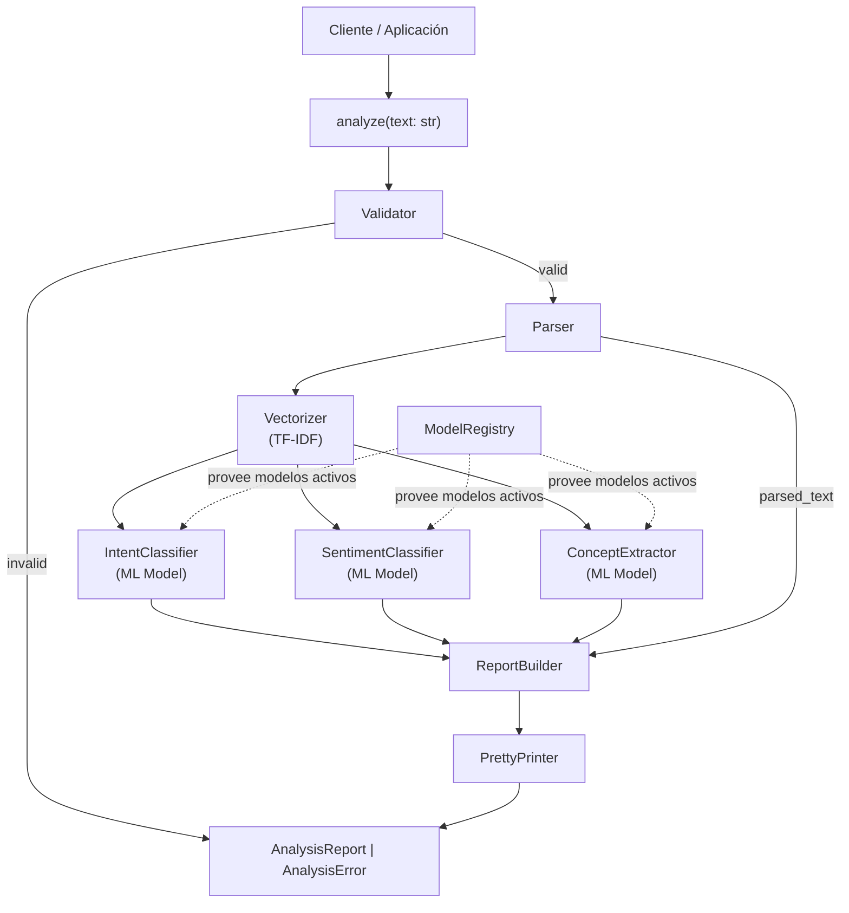

# Design Document

## Analizador de Textos de Ventas y Bienes Raíces

---

## Overview

El sistema es un analizador de textos en lenguaje natural especializado en el dominio de ventas y bienes raíces. Recibe un texto arbitrario (en español, inglés o mezcla de ambos) y produce un reporte estructurado con intención, sentimiento, conceptos de ventas, conceptos de bienes raíces y entidades extraídas.

**Principios de diseño:**

- **Stateless por diseño**: cada llamada a `analyze(text)` es completamente independiente. No existe estado compartido entre invocaciones.
- **Pipeline ML explícito**: el texto pasa por un pipeline determinístico: validación → parseo → vectorización → inferencia ML → generación de reporte.
- **Extensibilidad sin ruptura de interfaz**: los modelos ML se gestionan a través de un `ModelRegistry` que permite actualizar versiones sin modificar la API pública.
- **Bilingüe**: el sistema soporta español, inglés y textos mixtos en todos los componentes.
- **Errores estructurados**: ningún error interno se propaga como excepción no manejada al caller; todos los errores se devuelven como `AnalysisError`.

**Interfaz pública:**

```python
def analyze(text: str) -> AnalysisReport | AnalysisError:
    ...
```

---

## Architecture

### Diagrama de alto nivel



### Flujo de datos

```
analyze(text: str)
  │
  ├─ Validator.validate(text) ──► AnalysisError  (si inválido)
  │
  ├─ Parser.parse(text) ──► ParsedText
  │
  ├─ Vectorizer.vectorize(parsed_text) ──► FeatureVector
  │
  ├─ IntentClassifier.predict(feature_vector) ──► IntentResult
  ├─ SentimentClassifier.predict(feature_vector) ──► SentimentResult
  ├─ ConceptExtractor.extract(feature_vector, parsed_text) ──► ConceptResult
  │
  └─ ReportBuilder.build(...) ──► AnalysisReport
```

### Decisiones de arquitectura

| Decisión | Elección | Justificación |
|---|---|---|
| Vectorización | TF-IDF (scikit-learn) | Eficiente, interpretable, sin dependencias de GPU, adecuado para textos cortos del dominio |
| Clasificadores | `LinearSVC` / `LogisticRegression` (scikit-learn) | Rápidos en inferencia, buenos resultados con TF-IDF, soporte nativo de probabilidades |
| Extracción de conceptos | Clasificador multi-label + reglas de post-procesado | Combina generalización ML con precisión en entidades numéricas |
| Serialización | `dataclasses` + `json` stdlib | Sin dependencias externas, serialización determinística |
| Gestión de modelos | `ModelRegistry` en memoria con carga desde disco | Permite hot-swap de modelos sin reinicio |
| Concurrencia | Stateless + modelos read-only | Thread-safe por diseño; no requiere locks en el path de inferencia |

---

## Components and Interfaces

### 1. `Validator`

Verifica que el texto de entrada cumple los requisitos mínimos antes de procesarlo.

```python
class Validator:
    MIN_LENGTH: int = 3
    MAX_LENGTH: int = 50_000

    def validate(self, text: str) -> ValidationResult:
        """
        Retorna ValidationResult.ok() si el texto es válido,
        o ValidationResult.error(code, message) si no lo es.
        """
```

**Reglas de validación (en orden):**
1. `len(text) < 3` → `"Input text is too short to analyze"`
2. `len(text) > 50_000` → `"Input text exceeds maximum allowed length"`
3. `text.strip() == ""` → `"Input text contains no analyzable content"`
4. En caso contrario → válido, pasa el texto sin modificación

---

### 2. `Parser`

Transforma el texto en una representación estructurada (`ParsedText`).

```python
class Parser:
    def parse(self, text: str) -> ParsedText:
        """
        Tokeniza y segmenta el texto.
        Retorna ParsedText con tokens normalizados y lista de oraciones.
        """

    def print(self, parsed: ParsedText) -> str:
        """
        Serializa un ParsedText de vuelta a string.
        Garantiza round-trip: parse(print(parse(text))) ≡ parse(text)
        """
```

**Algoritmo de parseo:**
```
1. Normalizar: strip() del texto completo
2. Segmentar en oraciones: split por ['.', '!', '?'] preservando el delimitador
3. Para cada oración:
   a. Tokenizar: split por espacios y signos de puntuación no-sentencia
   b. Normalizar tokens: lowercase, strip de espacios
   c. Filtrar tokens vacíos
4. Construir ParsedText(tokens=lista_plana, sentences=lista_de_oraciones, original=text)
```

---

### 3. `Vectorizer`

Transforma el texto en una representación numérica para los modelos ML.

```python
class Vectorizer:
    def __init__(self, tfidf_model: TfidfVectorizer):
        self._tfidf = tfidf_model

    def vectorize(self, parsed_text: ParsedText) -> FeatureVector:
        """
        Aplica TF-IDF sobre los tokens del ParsedText.
        Retorna FeatureVector (scipy sparse matrix o numpy array).
        """

    def fit(self, corpus: list[str]) -> None:
        """Solo usado en entrenamiento, no en inferencia."""
```

**Notas de diseño:**
- El `TfidfVectorizer` se entrena sobre el corpus del dominio y se serializa junto con los modelos.
- En inferencia, solo se llama `transform()`, nunca `fit_transform()`.
- El vectorizador es compartido entre los tres clasificadores para consistencia.

---

### 4. `IntentClassifier`

Clasifica la intención principal del texto.

```python
class IntentClassifier:
    INTENTS = ["OFFER", "INQUIRY", "NEGOTIATION", "CLOSING", "DESCRIPTION", "UNKNOWN"]
    UNKNOWN_THRESHOLD: float = 0.3

    def __init__(self, model: BaseEstimator, model_metadata: ModelMetadata):
        self._model = model
        self.metadata = model_metadata

    def predict(self, feature_vector: FeatureVector) -> IntentResult:
        """
        Retorna IntentResult con:
        - intent: str (uno de INTENTS)
        - confidence: float [0.0, 1.0]
        Si max(probabilities) < UNKNOWN_THRESHOLD → intent = "UNKNOWN", confidence = 0.0
        """
```

**Pseudocódigo de inferencia:**
```
probabilities = model.predict_proba(feature_vector)[0]
max_prob = max(probabilities)
max_idx  = argmax(probabilities)

if max_prob < UNKNOWN_THRESHOLD:
    return IntentResult(intent="UNKNOWN", confidence=0.0)
else:
    return IntentResult(intent=INTENTS[max_idx], confidence=max_prob)
```

---

### 5. `SentimentClassifier`

Evalúa el tono emocional del texto.

```python
class SentimentClassifier:
    SENTIMENTS = ["POSITIVE", "NEUTRAL", "NEGATIVE"]

    def __init__(self, model: BaseEstimator, model_metadata: ModelMetadata):
        self._model = model
        self.metadata = model_metadata

    def predict(self, feature_vector: FeatureVector) -> SentimentResult:
        """
        Retorna SentimentResult con:
        - sentiment: str (uno de SENTIMENTS)
        - confidence: float [0.0, 1.0]
        Si el texto no contiene palabras con carga semántica → NEUTRAL, confidence=1.0
        """
```

---

### 6. `ConceptExtractor`

Extrae conceptos de ventas y bienes raíces del texto.

```python
class ConceptExtractor:
    def __init__(
        self,
        sales_model: BaseEstimator,
        real_estate_model: BaseEstimator,
        model_metadata: ModelMetadata,
    ):
        self._sales_model = sales_model
        self._re_model = real_estate_model
        self.metadata = model_metadata

    def extract(
        self, feature_vector: FeatureVector, parsed_text: ParsedText
    ) -> ConceptResult:
        """
        Retorna ConceptResult con:
        - sales_concepts: list[ConceptMatch]
        - real_estate_concepts: list[ConceptMatch]
        - entities: list[Entity]
        """
```

**Estrategia de extracción:**
1. Clasificador multi-label ML para detectar qué conceptos están presentes (con confidence scores).
2. Post-procesado con expresiones regulares para extraer valores numéricos y unidades (precios, metrajes, habitaciones).
3. Extracción de ubicaciones mediante patrones de texto y lista de términos geográficos del dominio.

---

### 7. `ModelRegistry`

Gestiona versiones de modelos ML y permite hot-swap sin reinicio.

```python
class ModelRegistry:
    def register(
        self,
        model: BaseEstimator,
        metadata: ModelMetadata,
    ) -> None:
        """Registra un nuevo modelo. No activa automáticamente."""

    def activate(self, model_id: str, version: str) -> None:
        """
        Activa una versión de modelo para uso en inferencia.
        Todos los analyze() posteriores usarán esta versión.
        """

    def get_active(self, domain: str) -> tuple[BaseEstimator, ModelMetadata]:
        """Retorna el modelo activo para el dominio dado."""

    def list_models(self) -> list[ModelMetadata]:
        """Lista todos los modelos registrados con sus metadatos."""
```

**Invariante de concurrencia:** `get_active()` es thread-safe mediante lectura atómica de referencia. `activate()` actualiza la referencia atómicamente.

---

### 8. `ReportBuilder`

Ensambla el `AnalysisReport` a partir de los resultados de los clasificadores.

```python
class ReportBuilder:
    def build(
        self,
        original_text: str,
        parsed_text: ParsedText,
        intent_result: IntentResult,
        sentiment_result: SentimentResult,
        concept_result: ConceptResult,
    ) -> AnalysisReport:
        """
        Construye y retorna un AnalysisReport completo con timestamp ISO 8601.
        """
```

---

### 9. `PrettyPrinter`

Serializa un `AnalysisReport` a JSON o texto plano.

```python
class PrettyPrinter:
    def to_json(self, report: AnalysisReport) -> str:
        """
        Serializa a JSON válido.
        Garantiza round-trip: from_json(to_json(report)) produce objeto equivalente.
        """

    def to_text(self, report: AnalysisReport) -> str:
        """
        Serializa a resumen legible en texto plano.
        Incluye: intent, sentiment, conceptos encontrados, entidades.
        """

    def from_json(self, json_str: str) -> AnalysisReport:
        """Deserializa desde JSON. Inversa de to_json."""
```

---

### 10. `Analyzer` (orquestador principal)

```python
class Analyzer:
    def __init__(self, registry: ModelRegistry):
        self._validator = Validator()
        self._parser = Parser()
        self._registry = registry

    def analyze(self, text: str) -> AnalysisReport | AnalysisError:
        """
        Punto de entrada público. Ejecuta el pipeline completo.
        Nunca lanza excepciones al caller.
        """
```

**Pseudocódigo del pipeline:**
```
def analyze(text: str) -> AnalysisReport | AnalysisError:
    try:
        # 1. Validación
        validation = validator.validate(text)
        if not validation.ok:
            return AnalysisError(
                error_code=validation.error_code,
                error_message=validation.error_message
            )

        # 2. Parseo
        parsed = parser.parse(text)

        # 3. Obtener modelos activos del registry
        vectorizer, _ = registry.get_active("vectorizer")
        intent_clf, intent_meta = registry.get_active("intent")
        sentiment_clf, sentiment_meta = registry.get_active("sentiment")
        concept_ext, concept_meta = registry.get_active("concept")

        # 4. Vectorización
        feature_vector = vectorizer.vectorize(parsed)

        # 5. Inferencia ML
        intent_result = intent_clf.predict(feature_vector)
        sentiment_result = sentiment_clf.predict(feature_vector)
        concept_result = concept_ext.extract(feature_vector, parsed)

        # 6. Construcción del reporte
        report = report_builder.build(
            original_text=text,
            parsed_text=parsed,
            intent_result=intent_result,
            sentiment_result=sentiment_result,
            concept_result=concept_result,
        )
        return report

    except Exception as e:
        return AnalysisError(
            error_code="ANALYSIS_ERROR",
            error_message=str(e)
        )
```

---

## Data Models

### `ValidationResult`

```python
@dataclass
class ValidationResult:
    ok: bool
    error_code: str | None = None
    error_message: str | None = None

    @staticmethod
    def success() -> "ValidationResult":
        return ValidationResult(ok=True)

    @staticmethod
    def failure(code: str, message: str) -> "ValidationResult":
        return ValidationResult(ok=False, error_code=code, error_message=message)
```

---

### `ParsedText`

```python
@dataclass
class ParsedText:
    original: str                    # Texto original sin modificar
    tokens: list[str]                # Lista plana de tokens normalizados
    sentences: list[list[str]]       # Tokens agrupados por oración
```

---

### `FeatureVector`

```python
# Alias de tipo; en la práctica es scipy.sparse.csr_matrix o numpy.ndarray
FeatureVector = Any  # scipy.sparse.csr_matrix
```

---

### `IntentResult`

```python
@dataclass
class IntentResult:
    intent: str          # "OFFER" | "INQUIRY" | "NEGOTIATION" | "CLOSING" | "DESCRIPTION" | "UNKNOWN"
    confidence: float    # [0.0, 1.0]
```

---

### `SentimentResult`

```python
@dataclass
class SentimentResult:
    sentiment: str       # "POSITIVE" | "NEUTRAL" | "NEGATIVE"
    confidence: float    # [0.0, 1.0]
```

---

### `ConceptMatch`

```python
@dataclass
class ConceptMatch:
    concept: str         # e.g., "offer", "discount", "property_type"
    confidence: float    # [0.0, 1.0]
    source_text: str     # Fragmento del texto original que originó la detección
```

---

### `Entity`

```python
@dataclass
class Entity:
    concept: str         # e.g., "price", "area_sqm", "location"
    raw_value: str       # Valor textual extraído (e.g., "USD 250,000", "Zona Norte")
    numeric_value: float | None   # Valor numérico si aplica (e.g., 250000.0)
    unit: str | None              # Unidad si aplica (e.g., "USD", "m2")
```

---

### `ConceptResult`

```python
@dataclass
class ConceptResult:
    sales_concepts: list[ConceptMatch]
    real_estate_concepts: list[ConceptMatch]
    entities: list[Entity]
```

---

### `AnalysisReport`

```python
@dataclass
class AnalysisReport:
    input_text: str
    intent: str                              # Valor de IntentResult
    intent_confidence: float
    sentiment: str                           # Valor de SentimentResult
    sentiment_confidence: float
    sales_concepts: list[ConceptMatch]
    real_estate_concepts: list[ConceptMatch]
    entities: list[Entity]
    analyzed_at: str                         # ISO 8601 timestamp (UTC)
```

**Ejemplo de serialización JSON:**

```json
{
  "input_text": "Ofrezco el apartamento en USD 180,000, negociable.",
  "intent": "OFFER",
  "intent_confidence": 0.87,
  "sentiment": "POSITIVE",
  "sentiment_confidence": 0.74,
  "sales_concepts": [
    {"concept": "offer", "confidence": 0.91, "source_text": "Ofrezco"},
    {"concept": "negotiation", "confidence": 0.78, "source_text": "negociable"}
  ],
  "real_estate_concepts": [
    {"concept": "property_type", "confidence": 0.95, "source_text": "apartamento"},
    {"concept": "price", "confidence": 0.99, "source_text": "USD 180,000"}
  ],
  "entities": [
    {
      "concept": "price",
      "raw_value": "USD 180,000",
      "numeric_value": 180000.0,
      "unit": "USD"
    }
  ],
  "analyzed_at": "2025-01-15T14:32:00Z"
}
```

---

### `AnalysisError`

```python
@dataclass
class AnalysisError:
    error_code: str      # e.g., "INPUT_TOO_SHORT", "INPUT_TOO_LONG", "ANALYSIS_ERROR"
    error_message: str
```

**Códigos de error definidos:**

| `error_code` | Origen |
|---|---|
| `INPUT_TOO_SHORT` | Texto < 3 caracteres |
| `INPUT_TOO_LONG` | Texto > 50,000 caracteres |
| `INPUT_EMPTY` | Texto solo whitespace/control |
| `ANALYSIS_ERROR` | Error interno durante el pipeline |

---

### `ModelMetadata`

```python
@dataclass
class ModelMetadata:
    model_id: str
    model_version: str
    domain: str          # "intent" | "sentiment" | "concept_sales" | "concept_real_estate" | "vectorizer"
    registered_at: str   # ISO 8601 timestamp
    is_active: bool = False
```

---

## Correctness Properties


*Una propiedad es una característica o comportamiento que debe mantenerse verdadero en todas las ejecuciones válidas del sistema — esencialmente, una declaración formal sobre lo que el sistema debe hacer. Las propiedades sirven como puente entre las especificaciones legibles por humanos y las garantías de corrección verificables por máquina.*

---

### Property 1: Validación de longitud — rechazo de textos fuera de rango

*Para cualquier* cadena de texto cuya longitud sea menor a 3 o mayor a 50,000 caracteres, `Validator.validate()` SHALL retornar un `ValidationResult` con `ok=False` y un `error_code` no nulo.

**Validates: Requirements 1.1, 1.2**

---

### Property 2: Rechazo de textos vacíos o solo-whitespace

*Para cualquier* cadena compuesta exclusivamente de caracteres de espacio en blanco o control (`\s`, `\t`, `\n`, `\r`, etc.), `Validator.validate()` SHALL retornar un `ValidationResult` con `ok=False` y `error_code="INPUT_EMPTY"`.

**Validates: Requirements 1.3**

---

### Property 3: Preservación del texto en validación exitosa

*Para cualquier* texto válido (longitud entre 3 y 50,000 caracteres, con contenido no-whitespace), el texto que llega al `Parser` SHALL ser idéntico al texto original proporcionado a `analyze()` — sin modificaciones, truncamientos ni transformaciones.

**Validates: Requirements 1.4**

---

### Property 4: Invariante de normalización de tokens

*Para cualquier* texto válido, todos los tokens producidos por `Parser.parse()` SHALL estar en minúsculas y no contener espacios en blanco al inicio ni al final (`token == token.strip().lower()`).

**Validates: Requirements 2.1**

---

### Property 5: Round-trip de parseo

*Para cualquier* texto válido `t`, aplicar `parse(print(parse(t)))` SHALL producir una lista de tokens equivalente a `parse(t).tokens`. Es decir, la serialización y re-parseo no altera la representación tokenizada.

**Validates: Requirements 2.3, 2.4**

---

### Property 6: Invariante de vocabulario de clasificaciones

*Para cualquier* texto válido analizado con `analyze()`, el campo `intent` del reporte SHALL ser uno de `{"OFFER", "INQUIRY", "NEGOTIATION", "CLOSING", "DESCRIPTION", "UNKNOWN"}`, y el campo `sentiment` SHALL ser uno de `{"POSITIVE", "NEUTRAL", "NEGATIVE"}`. Adicionalmente, todos los valores de `concept` en `sales_concepts` y `real_estate_concepts` SHALL pertenecer a los vocabularios de conceptos definidos en los requisitos.

**Validates: Requirements 5.1, 6.1, 3.1, 4.1**

---

### Property 7: Invariante de Confidence Scores

*Para cualquier* texto válido analizado con `analyze()`, todos los `Confidence_Score` presentes en el reporte (en `intent_confidence`, `sentiment_confidence`, y en cada `ConceptMatch.confidence`) SHALL ser valores numéricos en el intervalo cerrado `[0.0, 1.0]`.

**Validates: Requirements 3.2, 5.2, 6.2, 10.2**

---

### Property 8: Preservación del valor raw en entidades extraídas

*Para cualquier* texto válido que produzca entidades en el reporte, el campo `raw_value` de cada `Entity` SHALL ser una subcadena del texto original de entrada. La extracción no inventa valores que no estén presentes en el texto.

**Validates: Requirements 4.2, 4.3**

---

### Property 9: Round-trip de serialización JSON del reporte

*Para cualquier* `AnalysisReport` válido `r`, `to_json(from_json(to_json(r)))` SHALL producir una cadena JSON idéntica a `to_json(r)`. La serialización y deserialización son inversas exactas.

**Validates: Requirements 7.2, 7.4**

---

### Property 10: Estructura completa del reporte de análisis

*Para cualquier* texto válido analizado con `analyze()`, el resultado SHALL ser un `AnalysisReport` que contenga todos los campos requeridos: `input_text`, `intent`, `intent_confidence`, `sentiment`, `sentiment_confidence`, `sales_concepts`, `real_estate_concepts`, `entities`, y `analyzed_at` (timestamp ISO 8601 válido). Ningún campo SHALL ser `None`.

**Validates: Requirements 7.1, 12.1, 12.4**

---

### Property 11: Ausencia de excepciones no manejadas

*Para cualquier* cadena de texto (incluyendo cadenas vacías, muy largas, con caracteres especiales, en cualquier idioma, o con contenido arbitrario), una llamada a `analyze(text)` SHALL retornar un valor de tipo `AnalysisReport` o `AnalysisError` sin lanzar ninguna excepción al caller.

**Validates: Requirements 8.1, 8.3, 12.2, 12.3**

---

### Property 12: Determinismo y statelessness

*Para cualquier* texto válido `t`, llamar a `analyze(t)` múltiples veces con los mismos modelos activos SHALL producir resultados con `intent`, `sentiment`, y listas de conceptos idénticos en cada llamada. Adicionalmente, analizar una secuencia `analyze(tA)`, `analyze(tB)`, `analyze(tA)` SHALL producir resultados idénticos para `tA` en la primera y tercera llamada, demostrando que el análisis de `tB` no contamina el estado del sistema.

**Validates: Requirements 11.1, 11.2, 11.3**

---

### Property 13: Independencia de metadatos del Model Registry

*Para cualquier* conjunto de modelos registrados en el `ModelRegistry`, `list_models()` SHALL retornar una lista donde cada entrada contiene todos los campos requeridos: `model_id`, `model_version`, `domain`, y `registered_at` (timestamp ISO 8601 válido). Ningún campo SHALL ser `None` o vacío.

**Validates: Requirements 10.6**

---

## Error Handling

### Estrategia general

El sistema adopta el patrón **Result type** en lugar de excepciones para el flujo de control normal. Las excepciones solo se usan internamente y siempre se capturan en el boundary del `Analyzer`.

```
Caller
  │
  ▼
analyze(text) ──► AnalysisReport  (éxito)
               └─► AnalysisError  (cualquier fallo)
                   ├── error_code: str
                   └── error_message: str
```

### Jerarquía de errores

| Situación | `error_code` | Origen |
|---|---|---|
| Texto < 3 chars | `INPUT_TOO_SHORT` | `Validator` |
| Texto > 50,000 chars | `INPUT_TOO_LONG` | `Validator` |
| Texto solo whitespace | `INPUT_EMPTY` | `Validator` |
| Fallo en vectorización | `ANALYSIS_ERROR` | `Vectorizer` |
| Fallo en modelo ML | `ANALYSIS_ERROR` | Clasificadores |
| Cualquier excepción interna | `ANALYSIS_ERROR` | `Analyzer` (catch-all) |

### Fallback de modelos ML

Cuando un modelo ML falla durante la inferencia (excepción interna), el sistema aplica valores de fallback seguros en lugar de propagar el error:

```python
# Fallback values cuando el modelo falla
intent_fallback    = IntentResult(intent="UNKNOWN", confidence=0.0)
sentiment_fallback = SentimentResult(sentiment="NEUTRAL", confidence=0.0)
concept_fallback   = ConceptResult(sales_concepts=[], real_estate_concepts=[], entities=[])
```

Esto garantiza que un fallo en un clasificador individual no impide la generación del reporte completo.

### Manejo de errores en el pipeline

```python
# En cada clasificador, el patrón es:
try:
    result = model.predict_proba(feature_vector)
    return parse_result(result)
except Exception:
    return fallback_result  # Nunca propaga al caller
```

---

## Testing Strategy

### Enfoque dual

El sistema utiliza dos tipos complementarios de pruebas:

1. **Pruebas de propiedades (PBT)**: verifican invariantes universales sobre espacios de entrada amplios.
2. **Pruebas de ejemplo (unit tests)**: verifican comportamientos específicos, casos borde y puntos de integración.

### Librería de PBT

Se utilizará **[Hypothesis](https://hypothesis.readthedocs.io/)** (Python), la librería estándar de property-based testing para Python.

```python
from hypothesis import given, settings
from hypothesis import strategies as st
```

Cada prueba de propiedad se configura con mínimo **100 iteraciones**:

```python
@settings(max_examples=100)
@given(st.text(min_size=3, max_size=5000))
def test_property_N(text):
    ...
```

### Estrategias de generación (Hypothesis)

```python
# Texto válido
valid_text = st.text(
    alphabet=st.characters(blacklist_categories=("Cs",)),
    min_size=3,
    max_size=5000
).filter(lambda t: t.strip() != "")

# Texto demasiado corto
short_text = st.text(max_size=2)

# Texto demasiado largo
long_text = st.text(min_size=50_001)

# Texto solo whitespace
whitespace_text = st.text(
    alphabet=st.sampled_from([" ", "\t", "\n", "\r"]),
    min_size=1
)

# AnalysisReport arbitrario
analysis_report = st.builds(
    AnalysisReport,
    input_text=valid_text,
    intent=st.sampled_from(["OFFER", "INQUIRY", "NEGOTIATION", "CLOSING", "DESCRIPTION", "UNKNOWN"]),
    intent_confidence=st.floats(min_value=0.0, max_value=1.0),
    sentiment=st.sampled_from(["POSITIVE", "NEUTRAL", "NEGATIVE"]),
    sentiment_confidence=st.floats(min_value=0.0, max_value=1.0),
    sales_concepts=st.lists(concept_match_strategy),
    real_estate_concepts=st.lists(concept_match_strategy),
    entities=st.lists(entity_strategy),
    analyzed_at=st.just(datetime.utcnow().isoformat() + "Z"),
)
```

### Mapeo de propiedades a pruebas

| Propiedad | Tipo | Tag |
|---|---|---|
| Property 1: Validación de longitud | PBT | `Feature: text-sales-real-estate-analyzer, Property 1` |
| Property 2: Rechazo whitespace | PBT | `Feature: text-sales-real-estate-analyzer, Property 2` |
| Property 3: Preservación en validación | PBT | `Feature: text-sales-real-estate-analyzer, Property 3` |
| Property 4: Normalización de tokens | PBT | `Feature: text-sales-real-estate-analyzer, Property 4` |
| Property 5: Round-trip de parseo | PBT | `Feature: text-sales-real-estate-analyzer, Property 5` |
| Property 6: Vocabulario de clasificaciones | PBT | `Feature: text-sales-real-estate-analyzer, Property 6` |
| Property 7: Confidence scores en [0,1] | PBT | `Feature: text-sales-real-estate-analyzer, Property 7` |
| Property 8: Preservación raw_value | PBT | `Feature: text-sales-real-estate-analyzer, Property 8` |
| Property 9: Round-trip JSON | PBT | `Feature: text-sales-real-estate-analyzer, Property 9` |
| Property 10: Estructura del reporte | PBT | `Feature: text-sales-real-estate-analyzer, Property 10` |
| Property 11: Sin excepciones | PBT | `Feature: text-sales-real-estate-analyzer, Property 11` |
| Property 12: Determinismo/statelessness | PBT | `Feature: text-sales-real-estate-analyzer, Property 12` |
| Property 13: Metadatos del registry | PBT | `Feature: text-sales-real-estate-analyzer, Property 13` |

### Pruebas de ejemplo (unit tests)

Las siguientes situaciones se cubren con pruebas de ejemplo específicas:

- **Sinónimos de conceptos**: `"precio final"` → `closing`, `"rebaja"` → `discount` (Req. 3.4)
- **Umbral UNKNOWN**: mock del modelo con todas las probabilidades < 0.3 → `intent = "UNKNOWN"` (Req. 5.3)
- **Sentimiento NEUTRAL con confianza 1.0**: texto factual sin carga emocional (Req. 6.3)
- **Fallback de modelo**: mock que lanza excepción → valores de fallback correctos (Req. 10.7)
- **Confianza derivada del modelo**: mock con probabilidades conocidas → confidence scores coinciden (Req. 10.2)
- **Texto plano legible**: `to_text()` contiene intent y sentiment en el output (Req. 7.3)

### Pruebas de integración

- **Performance**: `analyze()` sobre texto de 5,000 caracteres completa en < 2 segundos (Req. 9.4)
- **Hot-swap de modelos**: registrar y activar modelo v2, verificar que `analyze()` usa el nuevo modelo (Req. 10.4, 10.5)
- **Pipeline completo**: texto en español, inglés y mixto produce `AnalysisReport` válido (Req. 12.3)
- **Concurrencia**: 10 llamadas concurrentes con textos distintos producen resultados independientes (Req. 11.4)

### Pruebas de smoke

- Verificar que `analyze` existe y tiene la firma correcta (Req. 9.1)
- Verificar que el pipeline llama a `vectorizer.vectorize()` antes de `model.predict()` (Req. 10.3)
- Verificar que `analyze()` con un texto nuevo (sin setup previo) retorna resultado válido (Req. 12.5)

### Estructura de archivos de prueba

```
tests/
├── unit/
│   ├── test_validator.py          # Properties 1, 2, 3
│   ├── test_parser.py             # Properties 4, 5
│   ├── test_pretty_printer.py     # Properties 9
│   ├── test_model_registry.py     # Property 13
│   └── test_examples.py           # Pruebas de ejemplo (sinónimos, umbrales, fallbacks)
├── integration/
│   ├── test_analyzer_pipeline.py  # Properties 6, 7, 8, 10, 11, 12
│   ├── test_performance.py        # Req. 9.4
│   ├── test_model_hotswap.py      # Req. 10.4, 10.5
│   └── test_concurrency.py        # Req. 11.4
└── smoke/
    └── test_smoke.py              # Req. 9.1, 10.3, 12.5
```
